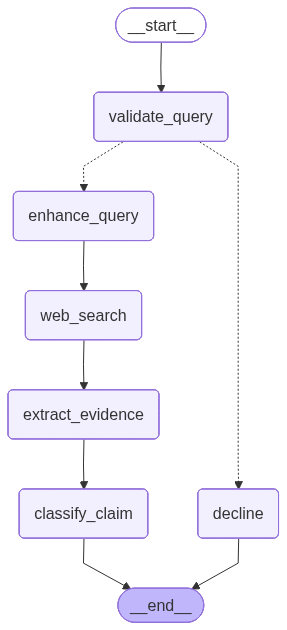

# **Reporte de Agente Híbrido para Verificación de Hechos: Arquitectura LangGraph Aplicada a la Verificación de Información de la NBA**

## **1\. Introducción y Contexto del Problema**

### **1.1. La Proliferación de la Desinformación Deportiva en Plataformas Digitales**

La National Basketball Association (NBA) constituye un entorno informativo de alta complejidad, caracterizado por el movimiento constante de datos estadísticos, rumores de traspasos y narrativas de alto perfil. Esta dinámica genera un volumen masivo de aserciones en plataformas digitales propensas a la desinformación. El uso de modelos de inteligencia artificial generativa para crear contenido engañoso ha acelerado la necesidad de mecanismos automatizados para la verificación factual.

El proyecto se enfoca en proporcionar un sistema que pueda discernir con precisión la veracidad de las afirmaciones específicas del dominio de la NBA.

### **1.2. Desafíos de la Verificación Factual Automatizada**

Los modelos de lenguaje grande (LLMs) de propósito general presentan deficiencias en tareas de verificación de hechos en dominios altamente específicos. Estos modelos son vulnerables a la **alucinación** y dependen de una ventana de conocimiento estática, lo cual es inadecuado para un dominio en tiempo real como la NBA.

El sistema propuesto combina la flexibilidad agéntica del LLM con datos estructurados de APIs oficiales y búsqueda web en tiempo real.

### **1.3. Objetivos del Proyecto**

**Objetivo General:**  
Desarrollar un agente híbrido orquestado mediante LangGraph para automatizar la verificación de hechos en aserciones relacionadas con la NBA.

**Objetivos Específicos:**

1. Diseñar e implementar un flujo de trabajo con LangGraph que gestione la verificación de hechos de manera secuencial y condicional.
2. Implementar una arquitectura híbrida que combine búsqueda web en tiempo real (Tavily Search) con datos estructurados de la NBA API.
3. Evaluar el rendimiento del sistema y su capacidad para manejar diferentes tipos de aserciones.

## **2\. Metodología y Diseño del Sistema**

### **2.1. Arquitectura con LangGraph**

El sistema se estructura utilizando LangGraph, un marco para la orquestación de flujos de trabajo de agentes complejos con estado (*stateful*). La capacidad de LangGraph para modelar flujos como grafos dirigidos permite definir pasos de razonamiento, recuperación y evaluación de manera condicional.

La metodología define el comportamiento del agente a través de: el Estado (State), los Nodos (Nodes) que codifican la lógica, y las Aristas (Edges) que definen las transiciones. La integración del sistema QA de la NBA (NBAQASystem) se realiza añadiendo sus métodos como nodos del grafo.

### **2.2. Fuentes de Evidencia Complementarias**

El sistema utiliza **dos fuentes de evidencia complementarias**:

1. **Web Search (Tavily):** Proporciona información en tiempo real, contexto narrativo y noticias de última hora, vital para un dominio dinámico como la NBA.  
2. **Sistema QA + NBA API:** Ofrece datos estructurados y estadísticas oficiales a través de la NBA API (nba_api), asegurando precisión en el ámbito estadístico. Utiliza un modelo de QA extractivo (deepset/roberta-base-squad2) para responder preguntas basadas en contexto recuperado de la API.

Mientras que la búsqueda web cubre la **novedad** (ej: resultados recientes), el sistema QA cubre **datos históricos y estadísticos** (ej: promedios de carrera). LangGraph orquesta la fusión de esta evidencia.

## **3\. Implementación del Agente**

El sistema de verificación se define a través de un grafo en LangGraph, donde la información se almacena y se transmite a través de un estado compartido.

### **3.1. Definición del Estado del Grafo**

El estado es una estructura de datos compartida (TypedDict) que evoluciona a medida que los nodos procesan la información:

| Campo | Tipo | Descripción |
| :---- | :---- | :---- |
| user_input | str | Consulta/aserción inicial del usuario |
| valid_query | str | Indicador de relevancia al dominio NBA ('YES'/'NO') |
| enhanced_query | str | Consulta optimizada para búsqueda |
| search_results | List[Document] | Documentos recuperados de Tavily Search |
| evidence | List[Evidence] | Evidencia combinada de web y API |
| sources | List[Source] | Fuentes con URLs, títulos y credibilidad |
| confidence | float | Puntuación promedio de credibilidad (0.0-1.0) |
| classification | ClassificationResult | REAL, FAKE o DOUBTFUL |
| explanation | str | Explicación generada por el LLM |

### **3.2. Nodos del Flujo de Trabajo**

  

1. **validate_query_node:** Utiliza un sistema híbrido: primero analiza entidades NBA (jugadores, equipos, estadísticas) con el analizador del NBAQASystem; si no encuentra entidades, usa un LLM como fallback. Actualiza `valid_query`.

2. **decide_over_input_node:** Borde condicional que inspecciona `valid_query`. Si es "YES", continúa a enhance_query_node; de lo contrario, a decline_node.

3. **decline_node:** Rechaza consultas irrelevantes con un mensaje explicativo.

4. **enhance_query_node:** Usa un LLM para optimizar la consulta, extrayendo entidades clave y mejorando la búsqueda.

5. **web_search_node:** Invoca Tavily Search API con restricción a fuentes confiables (nba.com, espn.com, basketball-reference.com, bleacherreport.com).

6. **extract_evidence_node:** Combina evidencia de dos fuentes:
   - Procesa los 3 primeros resultados de web search
   - Consulta el NBAQASystem (que usa nba_api) para datos estructurados
   - Genera lista de Evidence con información de fuentes y puntuaciones de relevancia

7. **classify_claim_node:** Usa un LLM con salida estructurada para clasificar como REAL, FAKE o DOUBTFUL, basado en toda la evidencia recopilada. Calcula confidence como promedio de credibilidad de fuentes.

## **4\. Resultados y Discusión**

### **4.1. Validación Cruzada de Fuentes**

El sistema se beneficia de la combinación de fuentes de evidencia. El LLM en el nodo classify_claim_node compara la información narrativa (web) con la información estadística (API) antes de emitir la clasificación final.

### **4.2. Complementariedad y Cobertura de Casos**

El diseño de doble fuente maneja el espectro completo de aserciones de la NBA:

| Tipo de Aserción | Fuente Primaria | Razón |
| :---- | :---- | :---- |
| Noticia reciente | Tavily Search | Eventos fuera de la ventana de datos de la API |
| Dato histórico/estadístico | NBAQASystem + API | Datos estructurados oficiales verificables |
| Validación cruzada | Ambas | Alta confianza al confirmarse por múltiples fuentes |

### **4.3. Consideraciones de Mejora**

Mejoras potenciales:

1. **Scoring Ponderado:** Asignar mayor peso a la evidencia de la API para claims estadísticos, y mayor peso a Tavily para noticias recientes.
2. **Detección de Conflictos:** Clasificar como DOUBTFUL cuando hay contradicciones entre fuentes.
3. **Ejecución Paralela:** Optimizar latencia ejecutando búsqueda web y consulta API simultáneamente.
4. **Mejora del Fine-Tuning del Modelo QA:** Para el demo y la entrega del proyecto se entrenó el modelo con pocos datos y ejemplos muy específicos. Con un dataset más amplio y diverso que incluya más jugadores, equipos, temporadas y tipos de consultas, el fine-tuning mejorado del modelo QA sería un excelente complemento a la herramienta de mitigación de desinformación, aumentando significativamente su precisión y cobertura.

## **5\. Conclusiones**

El proyecto desarrolla un agente de verificación de hechos especializado para el dominio de la NBA mediante la orquestación con LangGraph, demostrando la viabilidad de combinar múltiples fuentes de información complementarias para mejorar la precisión en la verificación de aserciones deportivas. La arquitectura híbrida implementada integra búsqueda web en tiempo real (Tavily) con el sistema QA basado en NBA API, permitiendo cubrir tanto información reciente como datos históricos y estadísticos, superando así las limitaciones de sistemas basados únicamente en conocimiento estático. El mecanismo de validación cruzada entre fuentes narrativas y datos estructurados proporciona mayor confiabilidad en la clasificación final, reduciendo significativamente el riesgo de alucinaciones del LLM. El uso de LangGraph permite implementar un flujo de trabajo robusto con bifurcaciones condicionales que filtran consultas irrelevantes, optimizan búsquedas y gestionan la evidencia de manera estructurada, garantizando trazabilidad en el proceso de verificación. La clasificación tripartita (REAL/FAKE/DOUBTFUL) con explicaciones generadas proporciona transparencia y contexto al usuario final.

---

## **Artículos Relacionados**

1. Gomstyn, A., & Jonker, A. (2025, Noviembre 18). AI misinformation. IBM. https://www.ibm.com/think/insights/ai-misinformation
2. Cui, Z., Huang, T., Chiang, C. E., & Du, C. (2025, Agosto). Toward Verifiable Misinformation Detection: A Multi-Tool LLM Agent Framework. In Proceedings of the 2025 International Conference on Generative Artificial Intelligence for Business (pp. 179-185).
3. Shuvrajyoti Debroy (2025, Agosto 22). LangGraph — Risk of Agentic AI. https://medium.com/@shuv.sdr/langgraph-risk-of-agentic-ai-3e314fe0d463
4. Cristian Valdez. (2023, Octubre 10). NBA Data — Using Python. https://medium.com/@cristianvaldez85/nba-data-using-python-82ebc0e19398